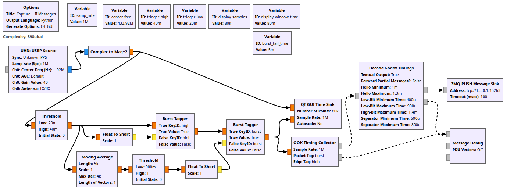
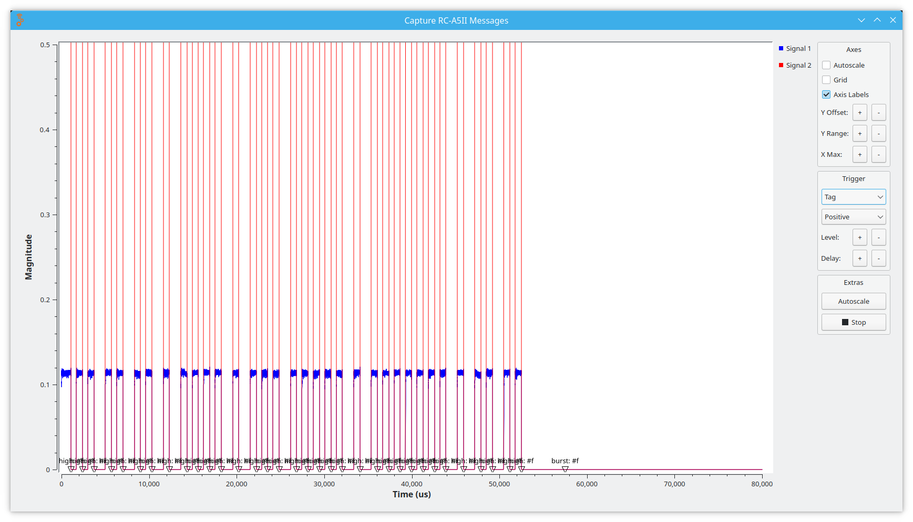

Emulator for Godox RC-A5II Remote Control
=========================================





Have Godox lights using a 433mHz remote? (Tested with VL150 and VL300)

Own a HackRF, USRP, or other software-defined radio platform compatible with GNU radio?

Want to be able to control your lights programatically?

This project provides everything you need.


Usage
=====

### Generating wireless sequences

This is the fun part! The blocks you'll use are as follows:

- `Godox Message Sanitizer`: Takes messages (of the form `{"group": 2, "chan": 11, "cmd": 0, "color": 1}`), fixes any values outside the range that can be represented, and adds a valid checksum.
- `Godox Message Muxer`: Responsible for deduplicating messages (taking only the most recent one per group and channel) and mixing them with enough delay between to allow reliable reception. Also emits gain control messages to avoid a DC offset signal when no transmission is actively desired.
- `Godox Message -> Bitfield`: Takes messages emitted by the sanitizer, and transforms to messages each containing a sequence of bits (`[0, 0, 1, 0, ...]`)
- `Godox Bitfield -> Timings`: Takes messages each containing a sequence of bits, and transforms to a sequence of values and timings (`[(#t, 13e-4), (#f, 6e-4), (#t, 7e-4), ...]`)
- `Timings -> OOK`: Takes messages each with a sequence of boolean values and times; generates a stream of floating-point values, suitable to be multiplied by a sine wave and sent out a radio.

See `fader.grc` for an example that fades one light off and the other one on as a slider is moved -- unlike the official Godox remote, this can go all the way down to 0% brightness.

### Storing wireless sequences

If you want to analyze behavior of your remote (perhaps you have a different model and it extends the protocol), this repository includes tools to capture sequences to a database for inspection.

- Invoke `src/godox_rc_emu/cmd/collect.py` with the name of a SQLite database as an argument.
- Invoke the provided `send-to-zmq.grc` GNU Radio Companion flowgraph, with a suitable antenna attached.
- Operate your remote control.

After you have collected some data, open up the SQLite database created by the collect script; the most interesting tables are `raw_messages` and `parsed_messages`.

```none
sqlite> select * from parsed_messages where grp_int=1 and chan_int=0 and value_int=100;
┌───────────────────────────────────┬──────────────────┬──────────┬─────────┬───────────┬──────────┬────────────┬───────────┬──────────┬─────────┬───────────┬──────────┬────────────┬───────────┬────────────────┐
│              content              │   hashed_bits    │ grp_bits │ grp_int │ chan_bits │ chan_int │ value_bits │ value_int │ cmd_bits │ cmd_int │ temp_bits │ temp_int │ cksum_bits │ cksum_int │ cksum_int_calc │
├───────────────────────────────────┼──────────────────┼──────────┼─────────┼───────────┼──────────┼────────────┼───────────┼──────────┼─────────┼───────────┼──────────┼────────────┼───────────┼────────────────┤
│ 000100000110010000011000000100010 │ 0001000001100100 │ 0001     │ 1       │ 0000      │ 0        │ 01100100   │ 100       │ 00       │ 0       │ 011000    │ 24       │ 00010001   │ 17        │ 17             │
└───────────────────────────────────┴──────────────────┴──────────┴─────────┴───────────┴──────────┴────────────┴───────────┴──────────┴─────────┴───────────┴──────────┴────────────┴───────────┴────────────────┘
```


Notes
=====

The included `database.sqlite.sql` file is present as an example of what collected data looks like, to allow people without access to the relevant equipment to collect their own data (or without the time to spend flipping through groups and channels to build a test corpus) to get started quickly.

"Godox" is trademark of GODOX PHOTO EQUIPMENT CO, LTD. None of this software is written, endorsed, supported by, or otherwise associated with this company, and their name is used only to identify the equipment with which this project's software is intended to be compatible.
